# Lab 3 - GitHub Actions

- [Configure GitHub Actions](#Configure-GitHub-Actions)
- [Deploy Application to Azure with GitHub Actions](#Deploy-Application-to-Azure-with-GitHub-Actions)
- [Automate Application Re-Deployment of Changes](#Automate-Application-Re-Deployment-of-Changes)
<!-- - [Scale Out Resources](#Scale-Out-Resources)
- [Clean Up Resources](#Clean-Up-Resources) -->

---

## Overview

The third lab will deploy a NodeJS Web App using GitHub Actions.

> Note: Lab 3 uses the same secret `AZURE_CREDENTIALS` as in Lab 1

## Configure GitHub Actions

1. Browse to the `workflows-templates/lab_3_webapps.yaml` file and copy all of the text.

2. Navigate to **Actions** and click **New Workflow**. If prompted to start with a sample workflow click the `Set up a workflow yourself` button in the top right.

3. Replace all of the sample workflow code in the editor by pasting all the code you copied from `workflows-templates/lab_3_webapps.yaml`.

4. Modify the Environment Variables section with the name of the Azure Resource Group to be creates, and the Azure Region to deploy the resources in as in Lab 2. We are also adding the name of our Azure Web App application and the Package Path to the application. Sele

> Note: The Azure Web App application name needs to be globally unique within Azure due to DNS registration. An error will occur if the same Azure Web App name was already used.

```yaml
env:
  RG_NAME: rg-lab-3
  LOCATION: eastus2
  AZURE_WEBAPP_NAME: azure-webapp-unique-name
  AZURE_WEBAPP_PACKAGE_PATH: ./lab_3/app
```

> Note: If changing the `LOCATION variable`, ensure that you use the proper Azure Region name. You can list the available regions for your subscription by running this command `az account list-locations -o table` in Azure Cloud Shell.

5. GitHub Actions files must be saved in a directory in your repo named `.github/workflows/`. The directory structure `.github/workflows/` should already exist in the path, name your workflow file `lab_3_webapps.yaml` and click `Start Commit`.

6. Add a short commit message and click `Commit new file`.

7. We will also need to modify the ARM template for the Azure Web App resource creation to align with the unique name provided in the step 4.

   Navigate to **Code**, open `lab_3/` directory, and open `webapps.deploy.json` file.

   Update the `defaultValue` for the `webAppName` parameter to the unique name.

> 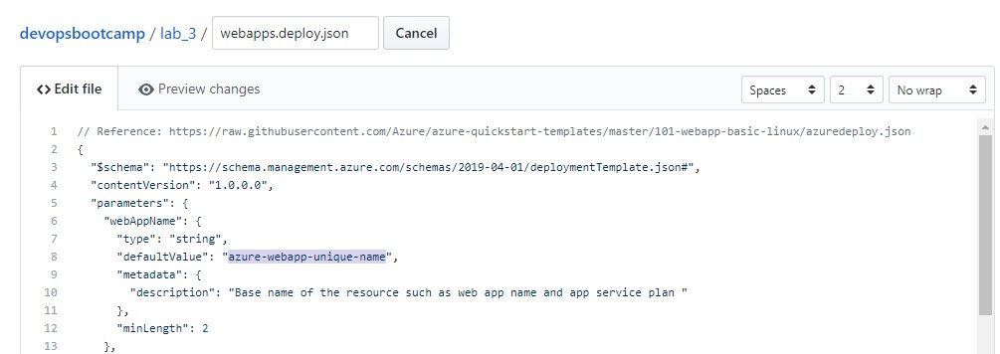

8. Enter a commit message and click `Commit changes`.

> 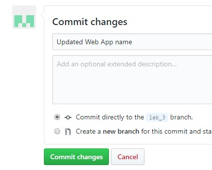

9. The last commit to change the Azure Web App name causes a run of the Workflow. Navigate to **Actions** to observe the workflow status.

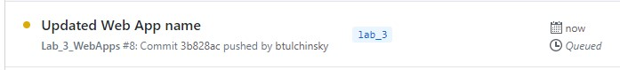

## Fix Workflow Due to Failed Test (TO BE REMOVED)

If you check the status of the Workflow, you will notice that the pipeline failed.

It is common to run simple unit tests to ensure that the code components work as expected. In our case, we have an API that returns the wrong text. The test is expecting the text to be `Hello, World!`, while the API returned `Hello, World!!` - We have an extra exclamation mark (!).

Let's correct this error.

1. Navigate to **Code**, open `lab_3/app/` directory, and open the `index.js` file.

This is a simple node application that serves static html, but also acts as a service controller for the `/test` mapped path.

2. The service returns a `200 OK` HTTP response code as well as some text. Notice the returned text was hard-coded with an two exclamation marks `Hello, World!!`, just like in our test. Edit and remove one of the exclamation marks so we only have one. The text should be `Hello, World!`.

3. Enter a commit message and click `Commit changes`.

4. Navigate to **Actions** to observe the workflow. Notice that the test was successful and runs the Azure WebApp deployment task.

## Deploy Application to Azure with GitHub Actions

Consider addition of below

> GitHub provides an action on GitHub marketplace to simplify deployments to Azure Web App application called `webapps-deploy`. For more information go [here](https://github.com/marketplace/actions/azure-webapp) for more information.

## Continuous Deployment of Changes

1. Navigate to **Code**, open the `lab_3/app/public` directory and open the `index.html` file.

2. Find the Octodex image element (`img` tag) identified with the `id` attribute `octodex`.

3) Go [here](https://octodex.github.com/) and copy the address of an Octodex that you like.

4) Update the `alt` and `src` attribute of the octodex `img` tag with description and copied address, respectively.

5) Enter a commit message and click `Commit changes`.

6) Navigate to **Actions** and observe the workflow.

7) When the workflow finished executing. Open your browser and refresh or open the `<Azure Web App name>.azurewebsites.net` website to observe the change in the application.

## Unit Testing

We have deployed our application successfully due to no unit test errors. We will not introduce an error into the application.

1. Navigate to **Code**, open the `lab_3/app/` directory and open the `index.js` file.

> 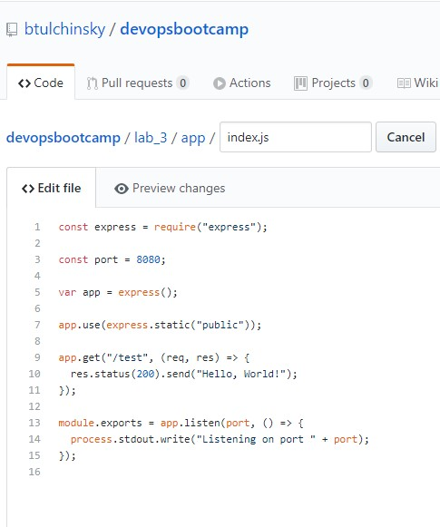

2. Change the `Hello, World!` text in the service `/path` response. It can be any misspelling or a completely different text, as long as it is different.

> 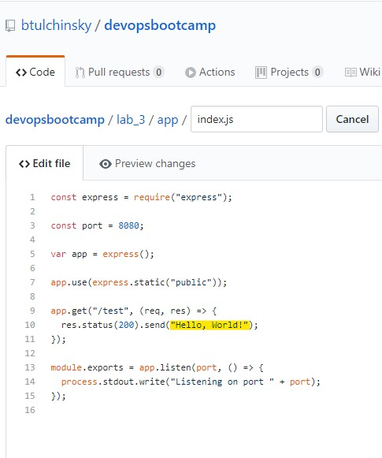

> 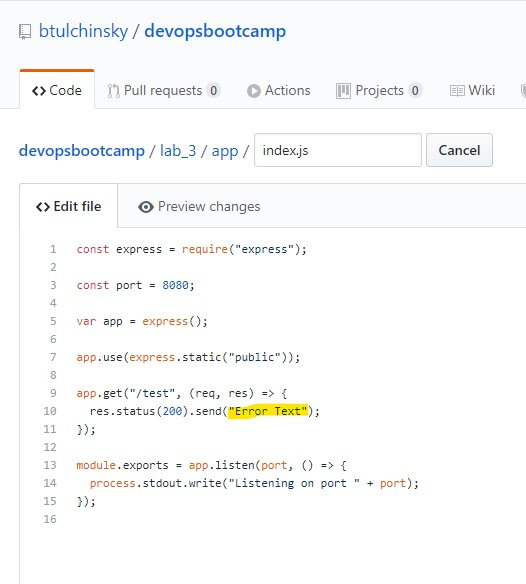

3. Enter a commit message and click `Commit changes`.

> 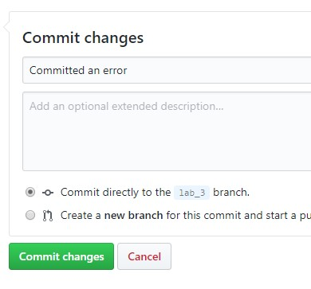

4. Navigate to **Actions** to observe the Workflow. Which will fail.

> 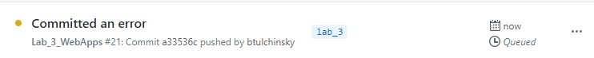

> 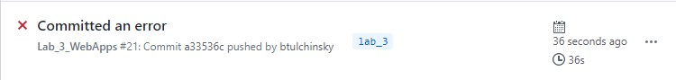

5. Click on the Workflow to take a look at the more granular tasks the Workflow is running and expand the `npm test` task.

> 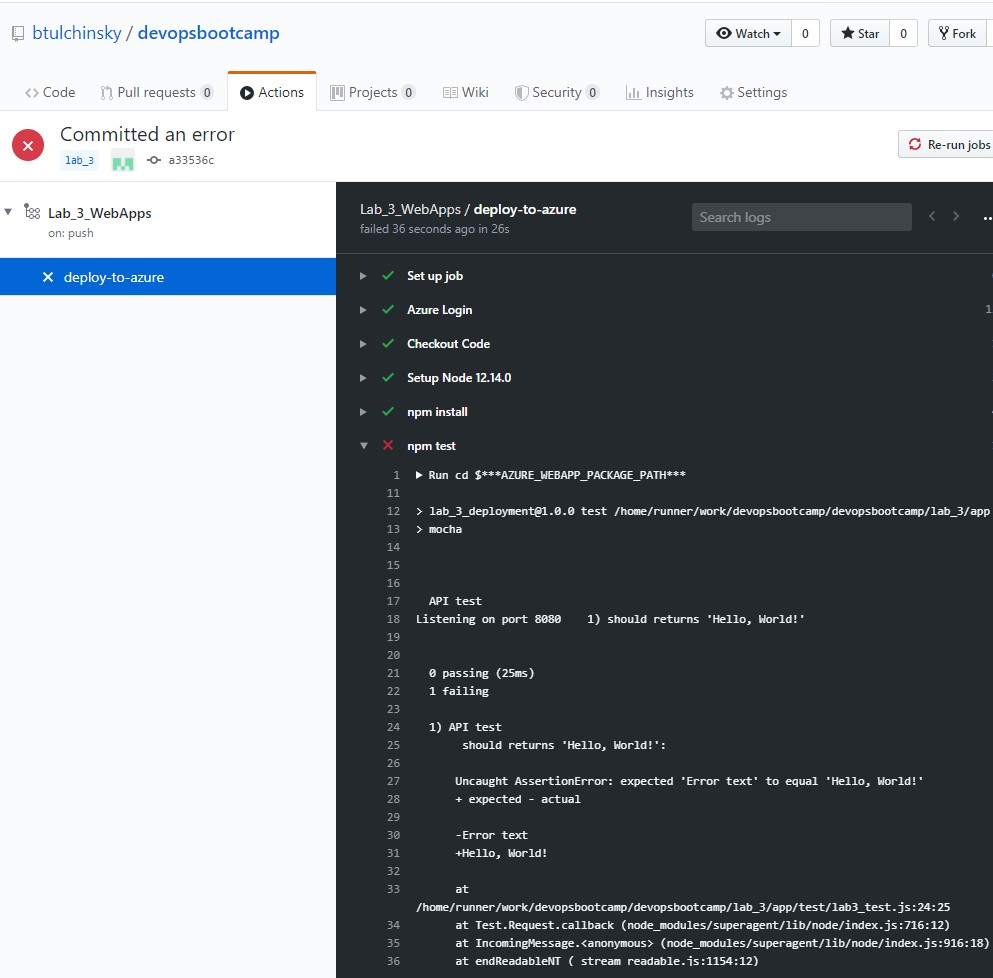

6. Notice that the `API test` unit test failed and the `Deploy to Azure WebApp` was not skipped. This is the default behaviour.

> 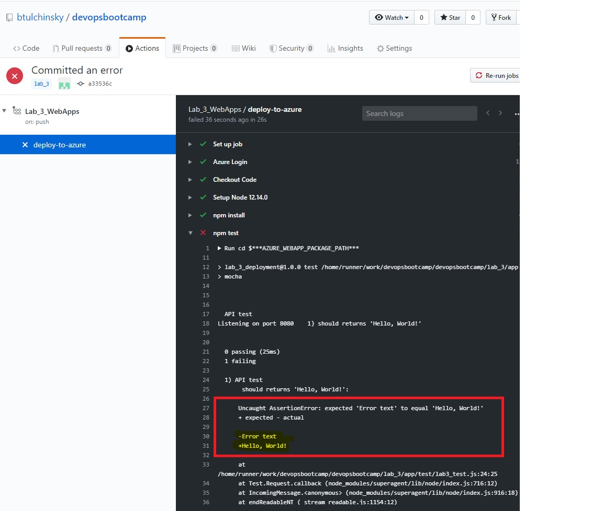

7. Notice that the `test pass message` was skipped, but the `test fail message` task did execute. This is because the `test fail message` has a conditional `if` conditional execution on Workflow failure.

```yaml
- name: test fail message
  if: failure()
  run: |
    echo "npm tests failed! please check your code"
```

This demonstrates some of the flexibility of GitHub Action Workflows. Click [here](https://help.github.com/en/actions/reference/workflow-syntax-for-github-actions) for more information on other constructs and Workflow syntax.

8. Fix the Workflow by correcting the `lab_3/app/index.js` file with the proper text and commit the change.
